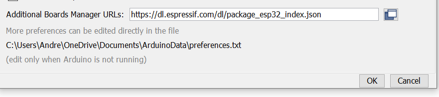
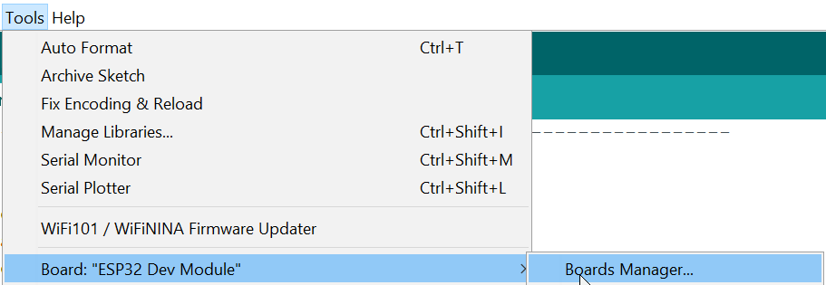
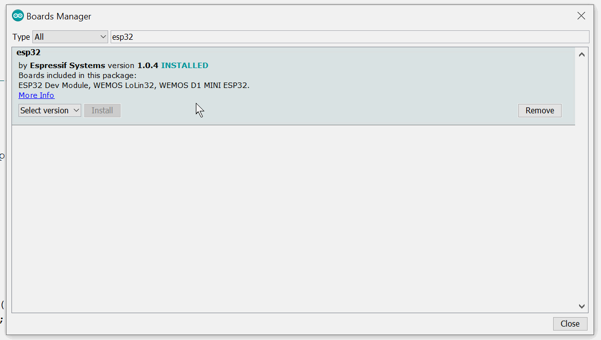
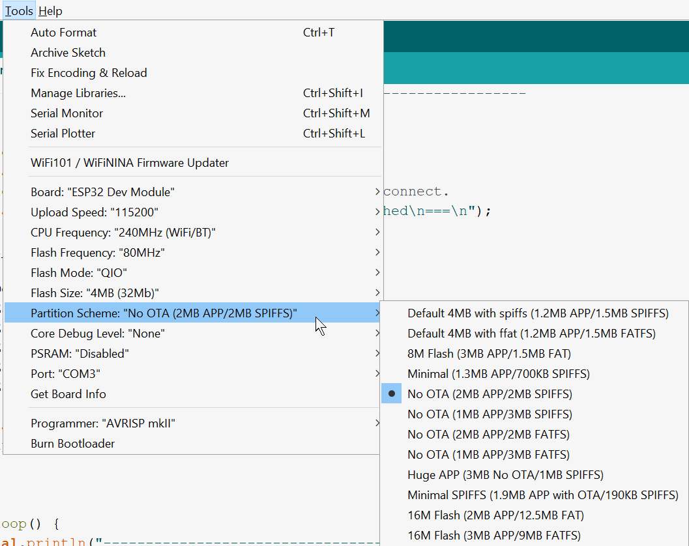
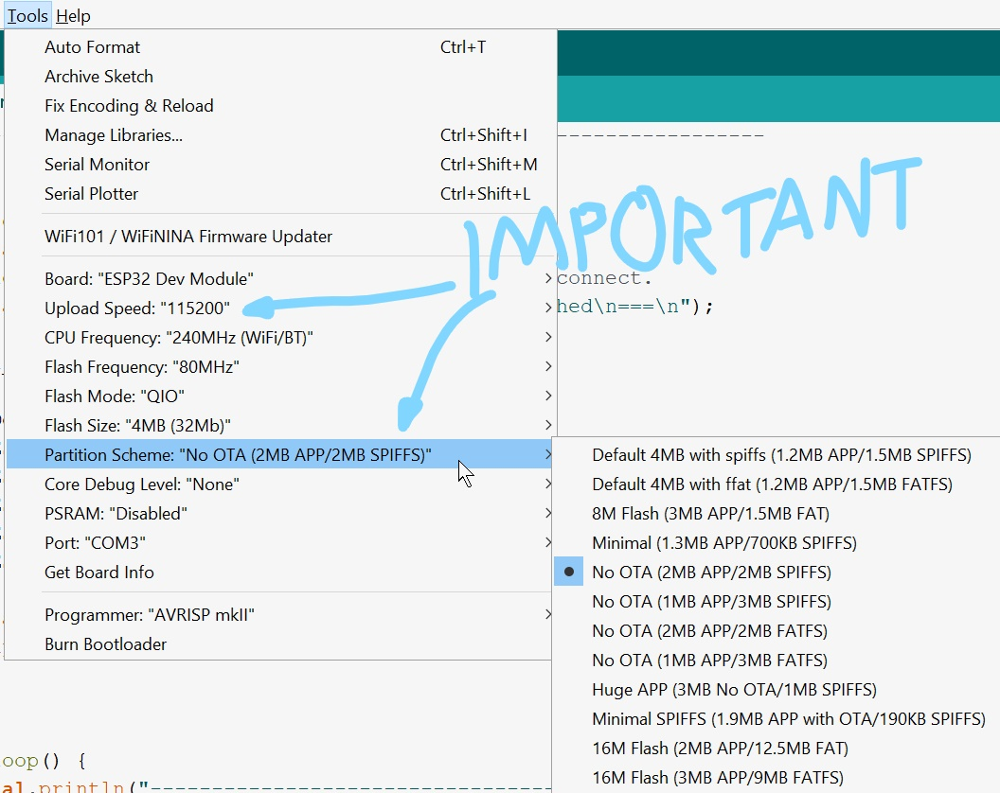
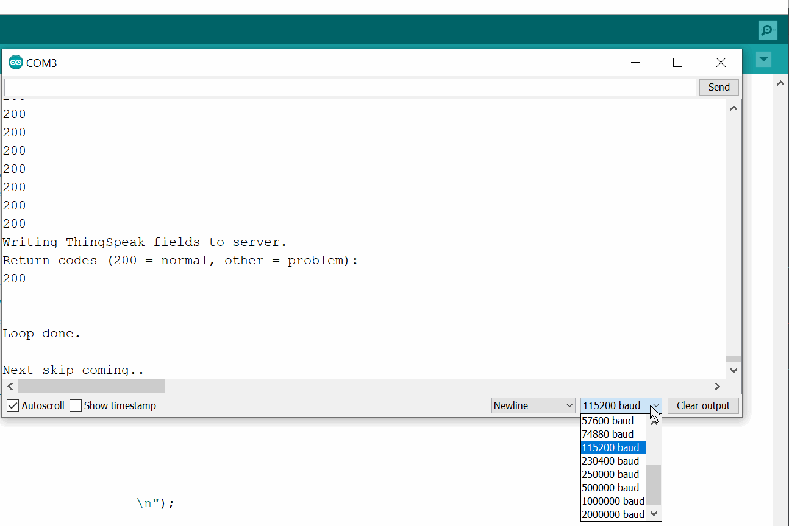
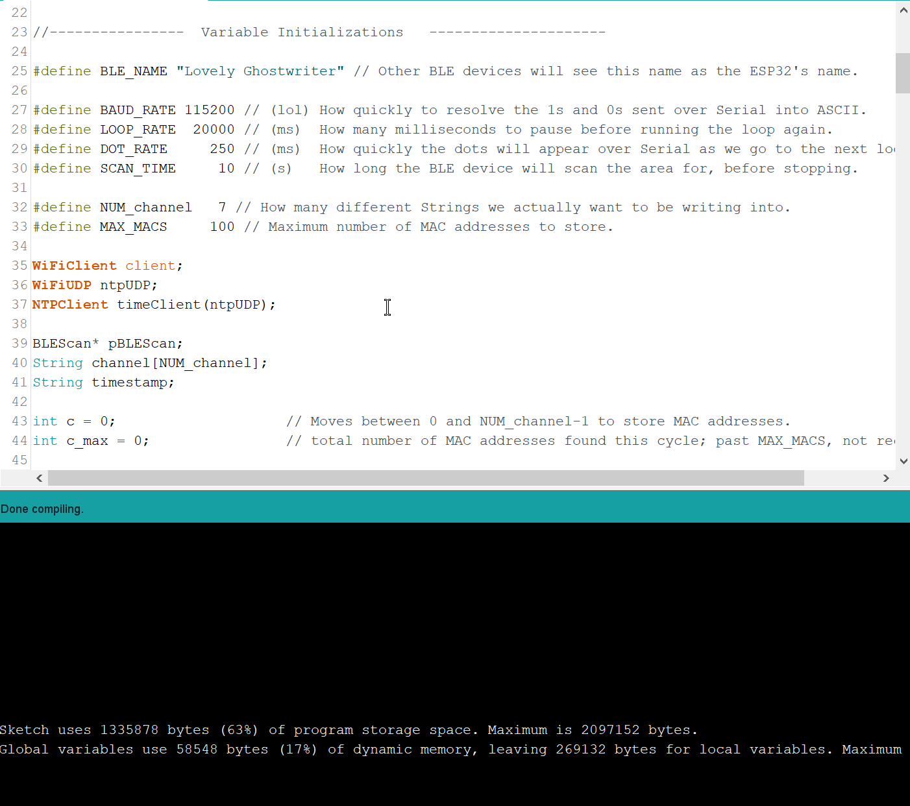
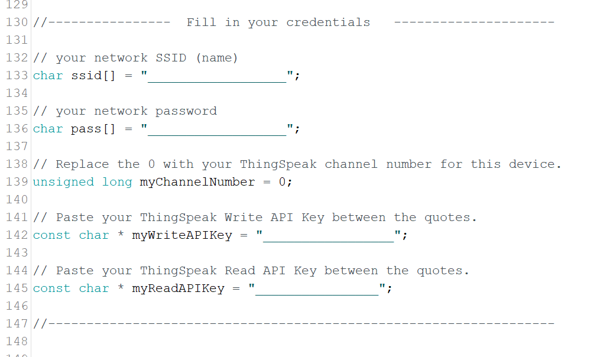
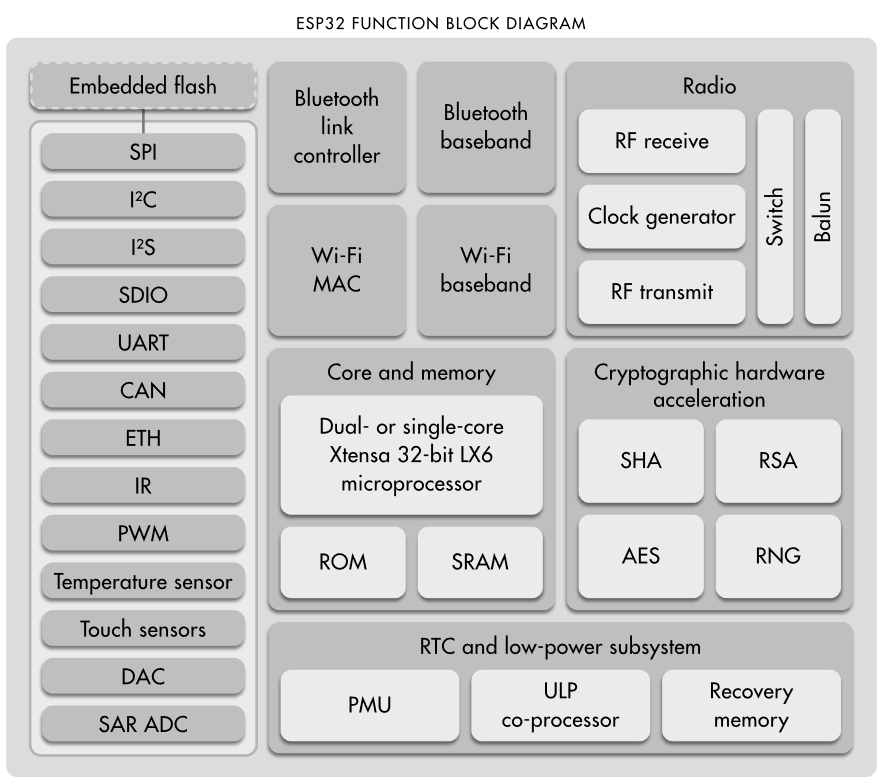
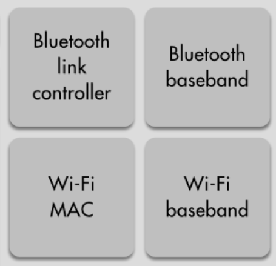

# Winter 2020 IEEE Project

The Arduino code is under `mac_addrs_to_thingspeak`.

# What the `mac_addrs_to_thingspeak` Arduino sketch does

- For each ESP 32:
  - Get on Wifi (hardcoded which one).
  - Connect to a [ThingSpeak channel](https://thingspeak.com/) (also hardcoded).
  - Turn on your Bluetooth radio.
  - Every 30 seconds:
    - Perform a Bluetooth sweep.
    - Upload the MAC addresses you see to ThingSpeak, along with a timestamp.

----------------------------------------

# Setup

This assumes you have already made copy of the code where you **gave it the WiFi crededentials and ThingSpeak API keys for _your_ situation**. If you haven't done that yet, do that first.

## Install ESP32 support to the Arduino IDE

Open  `Preferences`.

Add `https://dl.espressif.com/dl/package_esp32_index.json` to `Additional Boards Manager URLs`.

Then open up the `Boards Manager`, search for `esp32` and add Espressif's systems.

## Punch in ESP32 settings and verify the code compiles

Once that is installed, under `Tools`, set all of your settings to the following, **except `Port`** (which you should have discovered by yourself while testing your installation).

**Pay special note to `Upload Speed` and `Partition Scheme`.** If you don't set the upload speed correctly, you might have problems; if you don't set the partition scheme correctly, you might not have enough space to actually flash the damn thing.

Finally, open up the Serial Monitor in the top right corner  and change the baud rate  to `115200`.

If you've done everything, **your code should now compile correctly without size problems.** Hit Verify  and see for yourself.

## Copy the code SOMEWHERE PRIVATE and fill in your private credentials

If you want to keep everything together inside this GitHub, you can make an `_init/` folder that will be automatically ignored (check our `.gitignore` file to see for yourself).

But **you really don't want to fork this and modify the file in place**.

Doing so means that when you push those changes back up to GitHub, **anyone can see your API keys and read/write anything they want**, and more disturbingly, **anyone can see your WiFi information**.

## Upload, open Serial Monitor  and watch the magic!

------------------------------

## About the ESP32

Espressif Systems' little System on a Chip, the [ESP32](http://esp32.net/), is a really nifty little thing. It can do a ton of stuff for such a little chip, as you can see below.

*We* here on the Northwestern University, IEEE Hardware project, however, are pretty much just using it for these ones:

Ultimately, we are trying to
